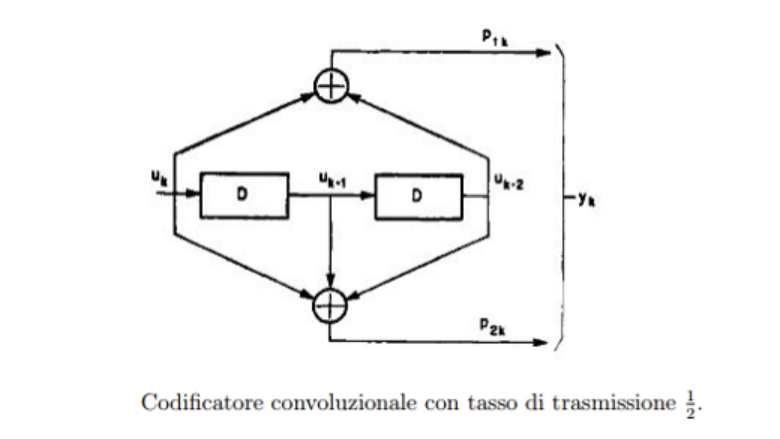
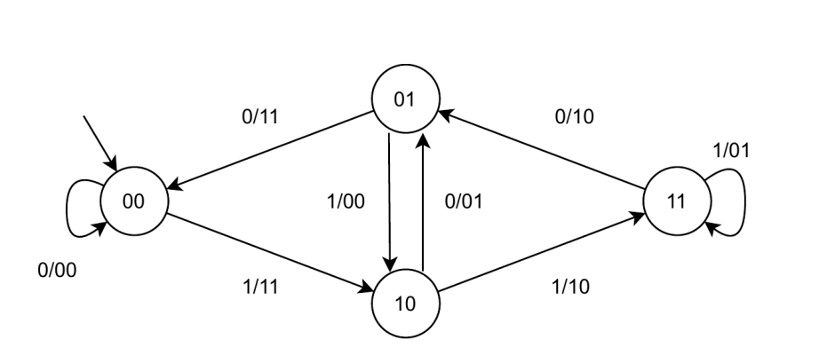

# Final Project of Digital Logic (Reti Logiche)

Professor D. Fornaciari, Professor G. Palermo, Professor F. Salice  
Politecnico di Milano  
January 12, 2021

## General Description

The specification of the “Final Exam (Digital Logic Project)” 2021/2022 requires the implementation of a hardware module (described in VHDL) that interfaces with a memory and follows the specification below.

The module receives as input a continuous sequence of `W` words, each word being 8 bits wide, and it returns as output a continuous sequence of `Z` words, each also 8 bits wide.

Each input word is serialized, generating a continuous bitstream `U` with width 1 bit.  
A convolutional code with rate 1/2 is then applied to this bitstream (each input bit is encoded into 2 bits) according to the scheme shown in the figure.  
This operation produces an output continuous bitstream `Y`.

The bitstream `Y` is obtained by alternated concatenation of the two output bits of the encoder.  
Using the notation from the figure, the input bit `uk` generates the two bits `p1k` and `p2k`, which are then concatenated to generate a continuous bitstream `yk` (still 1 bit wide).

Finally, this continuous stream is parallelized into 8 bits to form the 8-bit output words.  
The output sequence `Z` is therefore the sequence of these parallelized 8-bit values `yk`.



The length of the stream `U` is `8 * W`, while the length of the stream `Y` is `8 * W * 2` (so `Z = 2 * W`).  
The convolutional encoder is a synchronous sequential machine with a global clock and a reset signal.  
Its state diagram has `00` as the initial state, and each transition is annotated in the form `Uk / p1k, p2k`, where the outputs are given in the order `p1k` then `p2k`.



An example of operation is the following, where the first bit on the left (the most significant bit of the BYTE) is the first serial bit to be processed:

- INPUT BYTE = 10100010  
  (it is serialized as 1 at time t, 0 at time t+1, 1 at time t+2, 0 at time t+3, 0 at time t+4, 0 at time t+5, 1 at time t+6, and 0 at time t+7)

**By applying the convolutional algorithm, the following sequence of bit pairs is obtained:**

|     | 0   | 1   | 2   | 3   | 4   | 5   | 6   | 7   |
| --- | --- | --- | --- | --- | --- | --- | --- | --- |
| Uk  | 1   | 0   | 1   | 0   | 0   | 0   | 1   | 0   |
| P1k | 1   | 0   | 0   | 0   | 1   | 0   | 1   | 0   |
| P2k | 1   | 1   | 0   | 1   | 1   | 1   | 1   | 1   |

## Data

The module to be implemented must read the input sequence to be encoded from a memory with byte addressing; each memory word is one byte.  
This byte sequence is transformed into the bit stream `U` that must be processed.

The number of words `W` to be encoded is stored at address `0`.  
The first byte of the `W`-byte input sequence is stored at address `1`.  
The output stream `Z` must be stored starting from address `1000` (one thousand).

The maximum size of the input sequence is 255 bytes.

---

## Additional Notes on the Specification

1. The module will start processing when an input signal `START` is asserted (set to `1`).  
   The `START` signal will remain high until the `DONE` signal is asserted.  
   At the end of the computation (and once the result has been written to memory),  
   the designed module must raise (set to `1`) the `DONE` signal, which indicates the end of processing.  
   The `DONE` signal must remain high until the `START` signal is brought back to `0`.

   A new `START` signal cannot be given while `DONE` is still high.  
   Once `DONE` is returned to `0`, if `START` is asserted again,  
   the module must begin a new encoding phase.

2. The module must therefore be designed to encode multiple input streams one after another.  
   For each new encoding run (when `START` is asserted again after `DONE` has gone low),  
   the convolutional encoder must be brought back to its initial state `00`  
   (which is also its reset state).  
   The number of words to be encoded will always be stored at address `0`,  
   and the output must always be stored starting from address `1000`.

3. The module must be designed with the assumption that a reset (`RESET`) is always applied before the **first** encoding run.  
   However, as described in the protocol above, any **subsequent** encoding run does not require resetting the module — it is sufficient to wait for the end of the previous computation.

## Component Interface

The component to be implemented must have the following interface:

```vhdl
entity project_reti_logiche is
    port (
        i_clk     : in  std_logic;
        i_rst     : in  std_logic;
        i_start   : in  std_logic;
        i_data    : in  std_logic_vector(7 downto 0);
        o_address : out std_logic_vector(15 downto 0);
        o_done    : out std_logic;
        o_en      : out std_logic;
        o_we      : out std_logic;
        o_data    : out std_logic_vector(7 downto 0)
    );
end project_reti_logiche;

```

### Signal Description

- **Module name**  
  The name of the module must be `project_reti_logiche`.

- **`i_clk`**  
  The input CLOCK signal generated by the testbench.

- **`i_rst`**  
  The RESET signal that initializes the machine so that it is ready to receive the first `START` signal.

- **`i_start`**  
  The START signal generated by the testbench.

- **`i_data`**  
  The input data bus (vector) that comes from memory after a read request.

- **`o_address`**  
  The output address bus (vector) that sends the address to memory.

- **`o_done`**  
  The output signal that communicates:

  - the end of the computation,
  - and that the output data has been written to memory.

- **`o_en`**  
  The ENABLE signal that must be asserted to the memory in order to communicate with it (both for read and for write).

- **`o_we`**  
  The WRITE ENABLE signal that must be asserted (`= 1`) to allow writing to memory.  
  To read from memory this signal must be `0`.

- **`o_data`**  
  The output data bus (vector) that carries the data from the component toward the memory.
