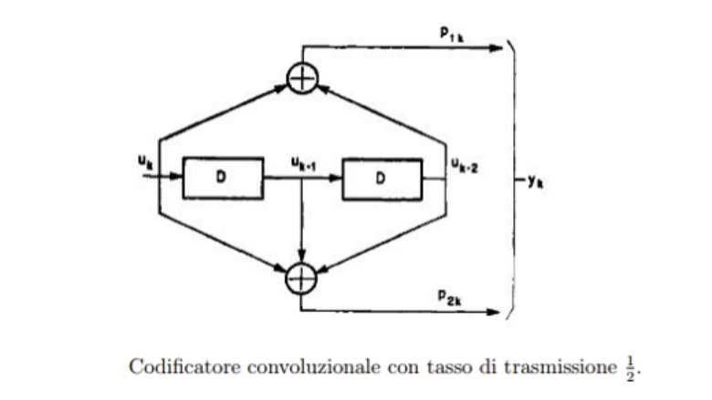

# Final Project of Digital Logic (Reti Logiche)

Prof. Fornaciari, Prof. Palermo, Prof. Salice  
(January 12, 2021)

## General Description

The specification of the “Final Exam (Digital Logic Project)” 2021/2022 requires the implementation of a hardware module (described in VHDL) that interfaces with a memory and follows the specification below.

The module receives as input a continuous sequence of `W` words, each word being 8 bits wide, and it returns as output a continuous sequence of `Z` words, each also 8 bits wide.

Each input word is serialized, generating a continuous bitstream `U` with width 1 bit.  
A convolutional code with rate 1/2 is then applied to this bitstream (each input bit is encoded into 2 bits) according to the scheme shown in the figure.  
This operation produces an output continuous bitstream `Y`.

The bitstream `Y` is obtained by alternated concatenation of the two output bits of the encoder.  
Using the notation from the figure, the input bit `uk` generates the two bits `p1k` and `p2k`, which are then concatenated to generate a continuous bitstream `yk` (still 1 bit wide).

Finally, this continuous stream is parallelized into 8 bits to form the 8-bit output words.  
The output sequence `Z` is therefore the sequence of these parallelized 8-bit values `yk`.

